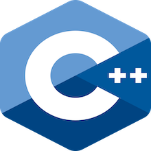

<p align="center">

</p>

## The C++ Programming Tutorial
------------------------------------------------

The C++ Programming Tutorial makes it easy to learn and fun for
all. This is merely an educational means to teach myself and
others C++ programming. I invite anyone to send me suggestions
and fix vulnerabilities or bugs.

## Compile samples
------------------------------------------------

Firstly the users should set up a project build directory before
compiling, this can be done with the following:

```console
meson setup <<builddir-name>>
```

The compile command builds a default or a specified target of a
configured Meson project, this can be done with the following:

```console
meson compile -C <<builddir name>>
```

## Reference material
------------------------------------------------

- [Meson Build System](https://mesonbuild.com/)
- [CppReference.com](https://en.cppreference.com/w/)
- [SEI CERT C++ Coding Standard](https://wiki.sei.cmu.edu/confluence/pages/viewpage.action?pageId=88046682)


## Contact the developer
------------------------------------------------

* outlook: [michaelbrockus@outlook.com](mailto:michaelbrockus@outlook.com)
* gmail: [michaelbrockus@gmail.com](mailto:michaelbrockus@gmail.com)